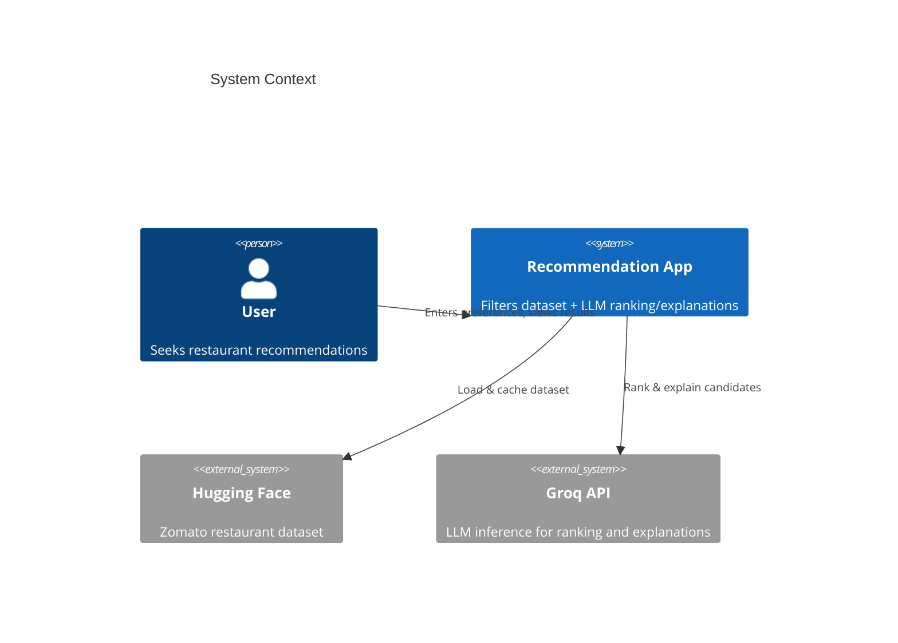
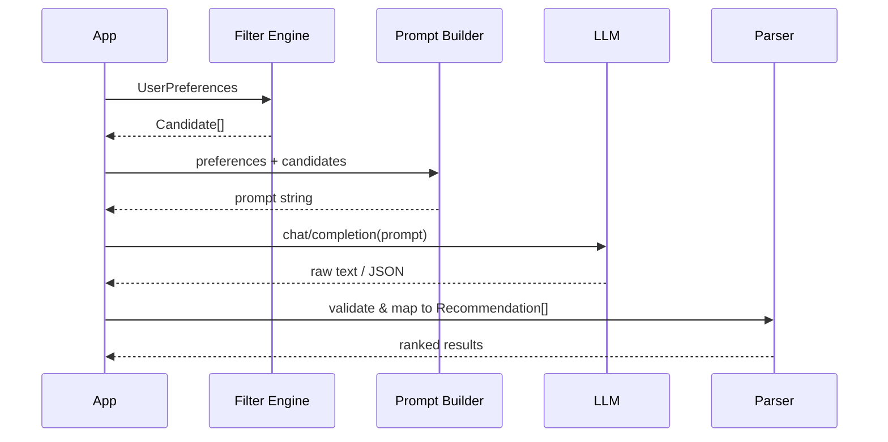
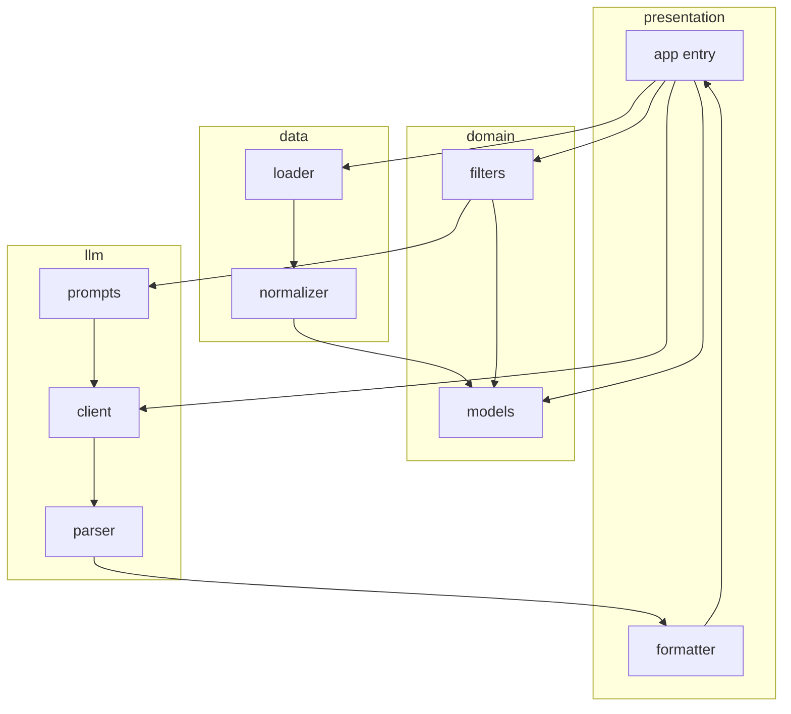
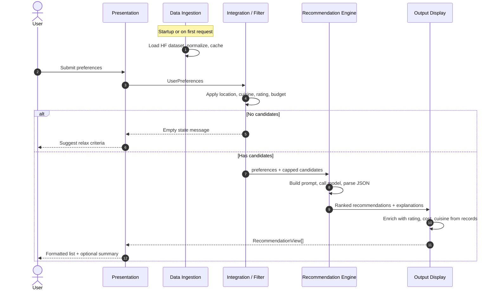

# System Architecture: AI-Powered Restaurant Recommendation System

This document defines the technical architecture for the Zomato-inspired restaurant recommendation service. It is derived from [`docs/context.md`](context.md) and describes components, data flows, interfaces, and implementation guidance.

---

## 1. Architectural Goals

| Goal | Description |
|------|-------------|
| **Hybrid intelligence** | Structured filtering on real dataset fields first; LLM used for ranking, explanation, and optional summary—not as the primary data store. |
| **Explainability** | Every surfaced recommendation includes a rationale tied to explicit user preferences. |
| **Usability** | Results are human-readable (name, cuisine, rating, cost, explanation)—not raw model output. |
| **Simplicity** | Default to a local app (CLI or lightweight web) with **Groq** as the v1 LLM provider; no auth or live Zomato API required for v1. |
| **Traceability** | Filter criteria and candidate set sent to the LLM should be inspectable for debugging and demos. |

---

## 2. System Context



**External actors**

- **User** — Provides location, budget tier, cuisine, minimum rating, and optional free-text preferences (e.g., family-friendly, quick service).
- **Hugging Face** — Source of truth for restaurant records: [ManikaSaini/zomato-restaurant-recommendation](https://huggingface.co/datasets/ManikaSaini/zomato-restaurant-recommendation).
- **Groq (LLM provider)** — Stateless inference for ranking and natural-language explanations via the [Groq API](https://console.groq.com/docs/overview). v1 uses Groq exclusively; the client layer remains swappable for other providers post-v1.

**In scope (v1)** — Dataset-backed recommendations, preference filtering, LLM enrichment, formatted output.

**Out of scope (v1)** — User accounts, persistence of user history, real-time Zomato API, multi-tenant deployment (unless extended later per context).

---

## 3. High-Level Architecture

The system follows a **pipeline architecture** with five logical stages aligned to the workflow in context:

```mermaid
flowchart LR
    subgraph ingestion["1. Data Ingestion"]
        HF[(Hugging Face Dataset)]
        Loader[Dataset Loader]
        Normalizer[Normalizer / Schema Mapper]
        Store[(In-Memory or Cached Table)]
        HF --> Loader --> Normalizer --> Store
    end

    subgraph input["2. User Input"]
        UI[Presentation Layer]
        Prefs[Preference Model]
        UI --> Prefs
    end

    subgraph integration["3. Integration Layer"]
        Filter[Structured Filter Engine]
        Builder[Prompt Context Builder]
        Prefs --> Filter
        Store --> Filter
        Filter --> Builder
    end

    subgraph engine["4. Recommendation Engine"]
        Prompt[Prompt Template]
        LLM[LLM Client]
        Parser[Response Parser / Validator]
        Builder --> Prompt --> LLM --> Parser
    end

    subgraph output["5. Output Display"]
        Formatter[Result Formatter]
        View[Results View]
        Parser --> Formatter --> View
        View --> UI
    end
```



**Design principle:** Data moves **downstream** as increasingly refined artifacts: raw rows → normalized records → filtered candidates → LLM-enriched recommendations → display DTOs.

---

## 4. Logical Layers

### 4.1 Data Ingestion Layer

**Responsibility:** Load, clean, and normalize the Hugging Face dataset into a consistent internal schema.

| Component | Role |
|-----------|------|
| **Dataset loader** | Uses `datasets` (Hugging Face) or equivalent to fetch splits; supports local cache after first download. |
| **Normalizer** | Maps source column names to canonical fields; handles missing values, type coercion (rating → float, cost → numeric or bucket). |
| **Schema validator** | Ensures required fields exist before the app accepts user queries. |

**Canonical restaurant record (internal)**

```text
RestaurantRecord {
  id: string              # stable row id
  name: string
  location: string        # city / area (normalized casing)
  cuisines: string[]      # split multi-value cuisine strings
  cost_for_two: number?   # or cost_bucket: "low" | "medium" | "high"
  rating: float
  attributes: dict?       # optional: delivery, dine-in, etc. if present in dataset
}
```

**Preprocessing steps**

1. Download/load dataset from Hugging Face URL.
2. Select and rename columns to canonical schema (name, location/neighborhood, cuisine, cost, rating).
3. Normalize location strings using the dataset's specific area/neighborhood column (e.g. Koramangala, Indiranagar, BTM, Bellandur, etc.) and fallback to city-level name from the address column only if neighborhood is missing. Normalize by title casing.
4. Parse cuisine field into a list; lowercase for matching.
5. Derive **budget bucket** from cost if only numeric cost exists (configurable thresholds per city optional in v2).
6. Drop or flag rows with null name or rating below dataset minimum integrity rules.
7. Materialize an in-memory `pandas` DataFrame, Polars table, or list of `RestaurantRecord` for fast filtering.

**Caching strategy (recommended)**

- First run: download to `data/cache/` or Hugging Face cache directory.
- Subsequent runs: load from cache; optional `--refresh` flag to re-fetch.

---

### 4.2 User Input Layer

**Responsibility:** Collect and validate user preferences; produce a typed `UserPreferences` object.

```text
UserPreferences {
  location: string              # required
  budget: "low" | "medium" | "high"   # required
  cuisine: string               # required (primary cuisine)
  min_rating: float             # required
  additional_notes: string?     # optional free text → passed to LLM
}
```

| Validation rule | Behavior |
|-----------------|----------|
| Location non-empty | Reject or prompt again |
| Budget enum | Map synonyms ("cheap" → low) in UI layer |
| Min rating | Clamp to [0, 5] or dataset max |
| Cuisine | Case-insensitive match against filter |

**Presentation options (choose one for v1)**

| Option | Pros | Cons |
|--------|------|------|
| **CLI** | Fastest to build, good for demos | Less friendly for non-technical users |
| **Web (Streamlit / Gradio)** | Rich forms, quick iteration | Heavier dependency |
| **REST API + simple frontend** | Clear separation, testable | More boilerplate |

Default recommendation from context: **Streamlit or CLI** for v1.

---

### 4.3 Integration Layer (Filter + Prompt Context)

**Responsibility:** Reduce the full dataset to a **bounded candidate set** and assemble structured context for the LLM.

#### 4.3.1 Structured Filter Engine

Apply **deterministic** filters in order (short-circuit optional):

```text
ALL restaurants
  → filter by location (exact or contains, configurable)
  → filter by cuisine (any cuisine tag matches user cuisine)
  → filter by min_rating (rating >= min_rating)
  → filter by budget bucket (cost mapped to low/medium/high)
```

| Parameter | Typical implementation |
|-----------|------------------------|
| Location | Case-insensitive equality or `location.contains(user.location)` |
| Cuisine | `user.cuisine in restaurant.cuisines` |
| Min rating | `restaurant.rating >= user.min_rating` |
| Budget | Compare `cost_for_two` to tier thresholds defined in config |

**Candidate cap:** If filtered set exceeds `MAX_CANDIDATES` (e.g., 30–50), pre-rank by rating descending and truncate before LLM call to control token cost and latency.

**Empty result handling:** If zero candidates, return a user-facing message without calling the LLM; suggest relaxing location, cuisine, or rating.

#### 4.3.2 Prompt Context Builder

Serializes filtered records into a compact JSON or markdown table for the prompt:

```json
{
  "user_preferences": { "location": "Bangalore", "budget": "medium", ... },
  "candidates": [
    { "id": "r1", "name": "...", "cuisines": ["Italian"], "rating": 4.2, "cost_for_two": 800 }
  ],
  "instructions": "Rank top N, explain each, optional summary"
}
```

Include only fields the LLM needs for reasoning; omit large unused columns.

---

### 4.4 Recommendation Engine (LLM)

**Responsibility:** Rank candidates, generate per-item explanations, optionally summarize the set.



#### 4.4.1 LLM client abstraction (Groq v1)

Define a narrow interface so the provider remains swappable after v1:

```text
LLMClient {
  complete(prompt: string, options?: { temperature, max_tokens }) → string
}
```

**v1 implementation:** `GroqClient` using the official [`groq`](https://github.com/groq/groq-python) Python SDK (or the OpenAI-compatible REST endpoint at `https://api.groq.com/openai/v1` if preferred).

| Component | Role |
|-----------|------|
| `GroqClient` | Production client; calls Groq chat completions |
| `MockLLMClient` | Tests and offline development; returns fixed JSON |

**Environment variables (v1):**

| Variable | Purpose | Example |
|----------|---------|---------|
| `GROQ_API_KEY` | Groq API secret (required for live calls) | `gsk_...` |
| `GROQ_MODEL` | Groq model id | `llama-3.3-70b-versatile` |
| `GROQ_BASE_URL` | Optional override | `https://api.groq.com/openai/v1` |
| `LLM_TEMPERATURE` | Sampling temperature | `0.3` |

Aliases `LLM_API_KEY` / `LLM_MODEL` may map to `GROQ_*` in `config/settings.py` for backward compatibility.

**Post-v1:** Additional implementations (e.g. other OpenAI-compatible hosts) can implement the same `LLMClient` interface without changing the pipeline.

#### 4.4.2 Prompt design

**System message (conceptual)**

- You are a restaurant recommendation assistant.
- Use **only** the provided candidate list; do not invent restaurants.
- Rank by fit to user preferences; respect budget and min rating.
- Output must be valid JSON (recommended) for reliable parsing.

**User message structure**

1. Restate user preferences (including `additional_notes`).
2. Attach candidate table (id, name, cuisine, rating, cost).
3. Ask for top `N` (e.g., 5) with: rank, restaurant id/name, short explanation.
4. Optional: one-paragraph summary of the overall selection.

**Example output contract (JSON)**

```json
{
  "summary": "These options balance Italian cuisine and mid-range budget in Bangalore.",
  "recommendations": [
    {
      "rank": 1,
      "restaurant_id": "r42",
      "name": "Example Bistro",
      "explanation": "Matches Italian preference, 4.5 rating, mid-range cost, suitable for families per your note."
    }
  ]
}
```

#### 4.4.3 Response parser and guardrails

| Guardrail | Action |
|-----------|--------|
| Hallucinated restaurant id | Drop entry; log warning; fill from candidate merge by name if unique match |
| Invalid JSON | Retry once with “fix JSON only”; else fallback to rating-sorted list with template explanations |
| LLM timeout / API error | Fallback: return top-N by rating with static template explanation |
| Token limit exceeded | Reduce `MAX_CANDIDATES` or shorten candidate serialization |

**Hybrid ranking note:** The LLM provides the **final order and copy**; structured pre-sort by rating can be hinted in the prompt as a weak prior, not a hard override unless LLM fails.

---

### 4.5 Output Display Layer

**Responsibility:** Merge LLM output with canonical restaurant fields and render for the user.

**Display DTO (per recommendation)**

```text
RecommendationView {
  rank: int
  name: string
  cuisine: string           # joined display string
  rating: float
  estimated_cost: string    # formatted from cost_for_two or bucket
  explanation: string       # from LLM
  location: string?         # optional for context
}
```

**Rendering rules**

- Show top N (configurable, default 5).
- If summary present, show above the list.
- Never show raw prompt or full candidate dump in production UI (debug mode optional).

---

## 5. Component Diagram (Modules)

Suggested package layout for implementation:

```text
restaurant-recommendation/
├── app/                      # Entry: CLI or Streamlit main
├── config/
│   └── settings.py           # Budget thresholds, MAX_CANDIDATES, LLM config
├── data/
│   ├── loader.py             # Hugging Face load
│   ├── normalizer.py         # Schema mapping
│   └── cache/                # Local dataset cache (gitignored)
├── domain/
│   ├── models.py             # RestaurantRecord, UserPreferences, Recommendation
│   └── filters.py            # Structured filter engine
├── llm/
│   ├── client.py             # LLMClient interface + implementations
│   ├── prompts.py            # Template strings
│   └── parser.py             # JSON extraction & validation
├── presentation/
│   └── formatter.py          # RecommendationView builder
└── tests/
    ├── test_filters.py
    └── test_parser.py
```



---

## 6. End-to-End Data Flow



---

## 7. Configuration

| Key | Purpose | Example |
|-----|---------|---------|
| `DATASET_ID` | Hugging Face dataset id | `ManikaSaini/zomato-restaurant-recommendation` |
| `BUDGET_LOW_MAX` | Upper bound for “low” tier | `500` |
| `BUDGET_MEDIUM_MAX` | Upper bound for “medium” | `1500` |
| `MAX_CANDIDATES` | Max rows sent to LLM | `40` |
| `TOP_N` | Recommendations shown | `5` |
| `GROQ_API_KEY` | Groq API key | (from [Groq Console](https://console.groq.com/keys)) |
| `GROQ_MODEL` | Groq model id | `llama-3.3-70b-versatile` |
| `GROQ_BASE_URL` | API base URL (optional) | `https://api.groq.com/openai/v1` |
| `LLM_TEMPERATURE` | Creativity vs consistency | `0.3` |

Budget thresholds should be documented and adjustable; dataset cost units may require calibration after first data exploration.

---

## 8. Error Handling and Resilience

| Scenario | User-facing behavior | Internal behavior |
|----------|----------------------|-------------------|
| Dataset download failure | “Unable to load restaurant data. Check connection.” | Log exception; retry with backoff |
| No matches after filter | Actionable empty state | Skip LLM call |
| LLM / Groq failure (401, 429, timeout) | Show rating-sorted top-N with generic explanation | Log error; metric increment; retry once on 429 |
| Malformed LLM JSON | Single retry; then fallback | Log raw response in debug |
| Partial field missing in dataset | Omit or “N/A” in display | Normalizer default values |

---

## 9. Non-Functional Requirements

| Attribute | Target (v1) |
|-----------|-------------|
| **Latency** | Filter < 1s on cached data; LLM bound by provider (aim &lt; 15s with capped candidates) |
| **Cost** | Cap candidates; use smaller model for demos |
| **Maintainability** | Swappable LLM client; config-driven thresholds |
| **Testability** | Unit tests for filters and parser; mock LLM in integration tests |
| **Observability** | Structured logs: preference hash, candidate count, LLM latency, fallback used |

---

## 10. Security and Privacy

- **API keys** — Load `GROQ_API_KEY` from environment only; never commit to repository. Obtain keys from the [Groq Console](https://console.groq.com/keys).
- **User input** — Sanitize free-text `additional_notes` before embedding in prompts (length limit, no control characters).
- **Prompt injection** — Instruct model to ignore instructions embedded in user notes that conflict with system rules; still treat notes as preference hints only.
- **Data** — Static public dataset; no PII storage in v1.

---

## 11. Deployment Options

| Mode | Description |
|------|-------------|
| **Local dev** | `python -m app` or `streamlit run app.py`; requires network for first dataset fetch and LLM calls |
| **Container** | Single image with cached dataset volume mount optional |
| **Cloud (future)** | API behind load balancer; secrets from vault; no change to core pipeline |

v1 default aligns with context: **single-process local app**, **Groq** as the LLM backend.

---

## 12. Testing Strategy

| Layer | Test focus |
|-------|------------|
| **Normalizer** | Column mapping, cuisine split, budget bucket derivation |
| **Filters** | Location/cuisine/rating/budget combinations; empty set |
| **Prompt builder** | Snapshot of serialized candidates; token size bounds |
| **Parser** | Valid JSON, invalid JSON, unknown ids, retry path |
| **E2E** | Mock LLM returns fixed JSON; assert display DTOs |

---

## 13. Success Criteria Mapping

Architecture satisfies project success criteria when:

| Criterion (from context) | Architectural mechanism |
|--------------------------|-------------------------|
| User enters all preference types | User Input layer + `UserPreferences` model |
| Ranked list from Zomato dataset | Filter engine + LLM rank + merge with records |
| Name, cuisine, rating, cost, explanation | Output Display `RecommendationView` |
| Understand why each fits | LLM `explanation` field per item + optional `summary` |

---

## 14. Evolution Path (Post-v1)

- Persist user sessions and history (new **User** store, optional auth).
- Embedding-based cuisine/location fuzzy match before LLM.
- A/B test prompt templates; evaluation harness with labeled preferences.
- REST API for mobile clients; rate limiting and API keys.
- Replace or augment dataset with live APIs (explicitly out of scope for v1).

---

## 15. Related Documents

| Document | Purpose |
|----------|---------|
| [`docs/context.md`](context.md) | Project scope, workflow, constraints, success criteria |
| [`docs/problemstatement.txt`](problemstatement.txt) | Original assignment text |

---

## Appendix A: Budget Tier Mapping

Until dataset-specific calibration is complete, use configurable numeric bands on `cost_for_two` (example values in INR-style units—adjust after data profiling):

| Tier | Condition (example) |
|------|---------------------|
| low | `cost_for_two <= BUDGET_LOW_MAX` |
| medium | `BUDGET_LOW_MAX < cost_for_two <= BUDGET_MEDIUM_MAX` |
| high | `cost_for_two > BUDGET_MEDIUM_MAX` |

If the dataset provides only categorical cost, map categories directly in the normalizer.

---

## Appendix B: Prompt Template Skeleton

```text
SYSTEM:
You recommend restaurants only from the CANDIDATES list. Output valid JSON only.

USER:
Preferences:
- Location: {location}
- Budget: {budget}
- Cuisine: {cuisine}
- Minimum rating: {min_rating}
- Additional: {additional_notes}

Candidates:
{candidates_table}

Return JSON with keys: summary (optional string), recommendations (array of
{rank, restaurant_id, name, explanation}). Top {top_n} only. Do not add restaurants not in the list.
```

This skeleton should be implemented in `llm/prompts.py` with versioning as prompts are tuned.
