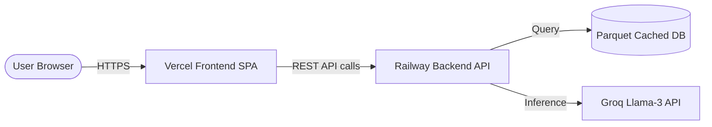

# Deployment Plan - Gastro AI Recommendation Concierge

This document outlines the step-by-step production deployment plan for the Zomato AI Concierge. We utilize a split architecture:
- **Backend API Layer**: Deployed to **Railway** (Python FastAPI)
- **Frontend SPA Layer**: Deployed to **Vercel** (React + Vite + TypeScript)

---

## Architecture Overview



---

## 1. Pre-Deployment Configuration

### Backend Dynamic Port Binding
Our backend is fully prepared for cloud deployment. In production, FastAPI automatically runs via the standard `uvicorn` runner. Railway automatically injects the `$PORT` environment variable.

### Frontend Environment Variables
The React client dynamically resolves the backend URL. In [App.tsx](file:///Users/darshan/Documents/Restaurant%20recomendation%20system/frontend/src/App.tsx), the API base is bound to Vite environment variables:
```typescript
const API_BASE = import.meta.env.VITE_API_URL || 'http://127.0.0.1:8000'
```

---

## 2. Backend Deployment on Railway

Railway is an excellent platform for deploying our high-performance FastAPI service. It automatically recognizes Python environments using `requirements.txt`.

### Step-by-Step Instructions

1. **Sign Up / Log In**: Go to [Railway.app](https://railway.app) and link your GitHub account.
2. **Create a New Project**:
   - Click **+ New Project** -> **Deploy from GitHub repo**.
   - Select your project repository.
3. **Configure the Start Command**:
   By default, Railway will search for your `requirements.txt` and build a Python environment. We have provided a **Procfile** at the root of the project to automatically configure the start command:
   ```yaml
   web: uvicorn app.api:app --host 0.0.0.0 --port ${PORT:-8000}
   ```
   If you need to configure or override it manually in the Railway dashboard:
   - Go to the **Settings** tab of your Railway service.
   - Set the **Start Command** explicitly to:
     ```bash
     uvicorn app.api:app --host 0.0.0.0 --port ${PORT:-8000}
     ```
4. **Configure Environment Variables**:
   Under the **Variables** tab, define the following keys:
   - `GROQ_API_KEY`: *[Your Production Groq LPU API Key]*
   - `PYTHONUNBUFFERED`: `1` (ensures Python logs flush immediately to the Railway terminal).
5. **Generate a Public Domain**:
   - Go to the **Settings** tab.
   - Under **Networking**, click **Generate Domain** (e.g. `gastro-api-production.up.railway.app`). Copy this URL.

---

## 3. Frontend Deployment on Vercel

Vercel is optimized for React/Vite SPAs. It provides fast deployments, instant global CDNs, and custom header configurations.

### Step-by-Step Instructions

1. **Sign Up / Log In**: Go to [Vercel.com](https://vercel.com) and link your GitHub account.
2. **Import Project**:
   - Click **Add New** -> **Project**.
   - Import your repository.
3. **Configure Project Settings**:
   - **Framework Preset**: Select **Vite** (Vercel automatically detects this).
   - **Root Directory**: Select the `frontend` folder (Click **Edit** next to Root Directory, select `frontend`, and click **Continue**).
   - **Build & Development Settings**:
     - Build Command: `npm run build`
     - Output Directory: `dist`
4. **Set Environment Variables**:
   Expand the **Environment Variables** section and add:
   - Key: `VITE_API_URL`
   - Value: *[Your Railway public domain URL from Section 2]* (e.g. `https://gastro-api-production.up.railway.app`)
5. **Deploy**:
   - Click **Deploy**. Vercel will bootstrap, install the dependencies, build the Vite bundles, and output your live production site URL (e.g., `gastro-ai.vercel.app`).

---

## 4. Post-Deployment Verification

### 1. Test Backend Health
Open a browser or terminal and query your Railway backend health endpoint:
```bash
curl https://gastro-api-production.up.railway.app/api/health
```
**Expected Response**:
```json
{"status": "ok", "service": "recommendation-engine"}
```

### 2. Test API Autocomplete Data
Verify dynamic preloading is working globally:
```bash
curl https://gastro-api-production.up.railway.app/api/locations
```
**Expected Response**: A JSON list containing Bangalore neighborhoods (e.g., `["BTM", "Bellandur", "Indiranagar", ...]`).

### 3. Verify Frontend Interactivity
Go to your production Vercel URL. Ensure that:
- The top bar displays **API Connected** (green pulsing badge).
- The Neighborhood and Cuisine dropdowns load selection choices dynamically.
- Inputting preferences and clicking **Find AI Recommendations** successfully executes the recommendation pipeline and loads custom Groq reasoning inside the cards.
