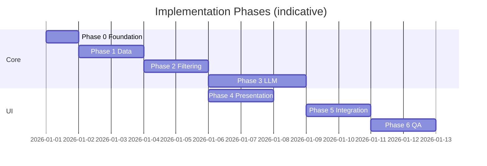
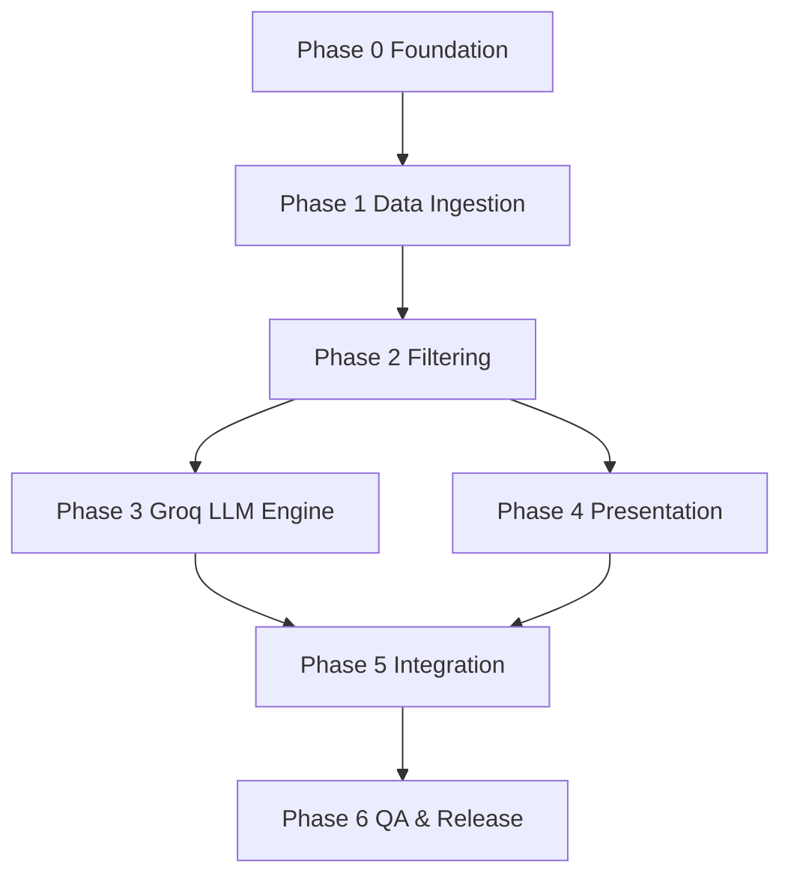

# Phase-Wise Implementation Plan

This plan translates [`docs/context.md`](context.md) and [`docs/architecture.md`](architecture.md) into ordered build phases. Each phase has goals, tasks, deliverables, and acceptance criteria. Complete phases in sequence unless noted; later phases depend on earlier artifacts.

---

## Plan Overview

| Phase | Name | Architecture alignment | Primary outcome |
|-------|------|------------------------|-----------------|
| 0 | Foundation & setup | §5 modules, §7 config | Runnable repo, dependencies, env template |
| 1 | Data ingestion | §4.1, workflow step 1 | Normalized, cached restaurant dataset |
| 2 | Domain & filtering | §4.3, workflow step 3 | Deterministic candidate selection |
| 3 | LLM recommendation engine (Groq) | §4.4, workflow step 4 | Ranked results + explanations via Groq API |
| 4 | Output & presentation | §4.2, §4.5, workflow steps 2 & 5 | User-facing app with formatted results |
| 5 | Integration & resilience | §6, §8, §9 | Full pipeline with fallbacks and empty states |
| 6 | Testing & release readiness | §12, §13, context success criteria | Verified v1 demo/submission |

**Estimated effort (solo developer):** Phases 0–4 ≈ 60–70% of work; Phases 5–6 ≈ 30%. Adjust if choosing Streamlit over CLI.

> Dates are illustrative; use phase exit criteria rather than calendar deadlines.

---

## Cross-Cutting Success Criteria (v1)

From context and architecture §13—the project is **done** when all are true:

- [ ] User can enter location, budget, cuisine, minimum rating, and optional notes
- [ ] Recommendations come only from the Hugging Face Zomato dataset (after filters)
- [ ] Each result shows: name, cuisine, rating, estimated cost, AI explanation
- [ ] User understands why each option was suggested (no raw LLM dump in default UI)
- [ ] Hybrid path: structured filter first, then LLM rank/explain (not LLM-only)

---

## Phase 0: Foundation & Project Setup

**Goal:** Establish repository structure, tooling, and configuration so later phases plug into a consistent layout.

**Architecture refs:** §5 (module layout), §7 (configuration), §10 (secrets)

### Tasks

- [ ] Initialize Python project (`pyproject.toml` or `requirements.txt`) with pinned versions
- [ ] Create directory scaffold per architecture §5:
  - `app/`, `config/`, `data/`, `domain/`, `llm/`, `presentation/`, `tests/`
- [ ] Add `data/cache/` to `.gitignore`
- [ ] Implement `config/settings.py` with env-backed defaults:
  - `DATASET_ID`, `BUDGET_LOW_MAX`, `BUDGET_MEDIUM_MAX`, `MAX_CANDIDATES`, `TOP_N`, `LLM_*`
- [ ] Add `.env.example` (no secrets): `GROQ_API_KEY`, `GROQ_MODEL`, `GROQ_BASE_URL`, `LLM_TEMPERATURE`
- [ ] Add minimal `README.md`: setup, env vars, how to run (placeholder commands OK)
- [ ] Choose v1 UI target: **CLI** or **Streamlit** (document decision in README)

### Deliverables

| Artifact | Description |
|----------|-------------|
| Repo scaffold | All packages importable (`python -m` or `PYTHONPATH`) |
| `config/settings.py` | Central configuration |
| `.env.example` | Documented environment variables |

### Acceptance criteria

- [ ] `pip install -r requirements.txt` (or equivalent) succeeds on a clean environment
- [ ] `from config.settings import settings` loads without error
- [ ] No API keys committed to git

### Dependencies

None.

---

## Phase 1: Data Ingestion & Exploration

**Goal:** Load the Hugging Face dataset, profile columns, normalize to `RestaurantRecord`, and cache for fast reuse.

**Architecture refs:** §4.1, Appendix A, context “Data Ingestion”

**Context refs:** Dataset URL, expected fields (name, location, cuisine, cost, rating)

### Tasks

- [ ] **Explore dataset** (notebook or script): list columns, sample rows, null rates, unique locations/cuisines
- [ ] Implement `data/loader.py`:
  - Load `ManikaSaini/zomato-restaurant-recommendation` via `datasets`
  - Support cache under `data/cache/` or HF cache
  - Optional `--refresh` / config flag to re-download
- [ ] Implement `data/normalizer.py`:
  - Map source columns → canonical schema (`id`, `name`, `location`, `cuisines[]`, `cost_for_two`, `rating`, optional `attributes`), mapping the `location` record field to the dataset's specific area/neighborhood name column.
  - Trim/normalize location using neighborhood labels, falling back to city-level name from the address column only if missing. Normalize by title casing.
  - Split cuisine string into lowercase list
  - Coerce `rating` to float; handle missing cost
  - Derive `cost_bucket` (`low` \| `medium` \| `high`) per Appendix A thresholds
  - Drop or skip rows missing `name` or invalid `rating`
- [ ] Implement schema validation: fail fast if required source columns missing after mapping
- [ ] Expose `load_restaurants() -> list[RestaurantRecord]` (or DataFrame wrapper) for downstream use
- [ ] Document actual column mapping in code comments or `docs/data-schema.md` (short)

### Deliverables

| Artifact | Description |
|----------|-------------|
| `data/loader.py` | HF load + cache |
| `data/normalizer.py` | Canonical records |
| `domain/models.py` (partial) | `RestaurantRecord` dataclass/Pydantic model |
| Exploration notes | Confirmed budget thresholds after profiling |

### Acceptance criteria

- [ ] First run downloads dataset; second run uses cache and is noticeably faster
- [ ] Normalized record count > 0; spot-check 5 rows manually
- [ ] Every record has `id`, `name`, `location`, `cuisines`, `rating`; cost or bucket present where dataset allows
- [ ] Budget buckets align with calibrated `BUDGET_LOW_MAX` / `BUDGET_MEDIUM_MAX`

### Dependencies

Phase 0.

### Risks & mitigations

| Risk | Mitigation |
|------|------------|
| Column names differ from docs | Exploration task first; mapping table in normalizer |
| Cost field ambiguous | Profile percentiles; adjust config thresholds |

---

## Phase 2: Domain Models & Structured Filtering

**Goal:** Accept `UserPreferences`, apply deterministic filters, cap candidates, handle empty results—**without** calling the LLM yet.

**Architecture refs:** §4.2 (models), §4.3.1, context workflow steps 2–3 (filter half)

### Tasks

- [ ] Complete `domain/models.py`:
  - `UserPreferences` (location, budget, cuisine, min_rating, additional_notes optional)
  - `Recommendation` (internal, pre-display) if needed
- [ ] Implement `domain/filters.py`:
  - Filter chain: location → cuisine → min_rating → budget bucket
  - Case-insensitive location (exact or contains—pick one, document in config)
  - Cuisine: user cuisine in `restaurant.cuisines`
  - Pre-rank by rating desc; truncate to `MAX_CANDIDATES`
- [ ] Empty-set helper: return structured message suggesting relaxed criteria (no LLM)
- [ ] Unit tests: `tests/test_filters.py`
  - Happy path with known fixture records
  - Zero results
  - Candidate cap when many matches
  - Edge: min_rating boundary, budget tier boundaries

### Deliverables

| Artifact | Description |
|----------|-------------|
| `domain/models.py` | `UserPreferences`, `RestaurantRecord` |
| `domain/filters.py` | `filter_restaurants(prefs, records) -> list[RestaurantRecord]` |
| `tests/test_filters.py` | Filter unit tests |

### Acceptance criteria

- [ ] Given fixture data + prefs, filter output is deterministic and reproducible
- [ ] Filter latency negligible on full cached dataset (architecture target &lt; 1s)
- [ ] When no matches, function returns empty list + reason code/message for UI
- [ ] All tests in `test_filters.py` pass

### Dependencies

Phase 1.

### Milestone: “Filter-only demo”

Optional CLI snippet: print top 10 filtered restaurants by rating (validates data + filters before LLM cost).

---

## Phase 3: LLM Recommendation Engine (Groq)

**Goal:** Build prompt context, call **Groq** for completions, parse JSON response, enforce guardrails with rating-based fallback.

**Architecture refs:** §4.3.2, §4.4, Appendix B, context workflow step 4

**LLM provider (v1):** [Groq](https://console.groq.com/docs/overview) — fast inference; OpenAI-compatible chat completions endpoint. Default model: `llama-3.3-70b-versatile` (configurable via `GROQ_MODEL`).

### Tasks

- [ ] Implement `llm/prompts.py`:
  - System + user templates (Appendix B)
  - `build_prompt(prefs, candidates, top_n) -> str`
  - Serialize candidates compactly (JSON or markdown table)
- [ ] Implement `llm/client.py`:
  - `LLMClient` protocol / ABC: `complete(prompt) -> str`
  - **`GroqClient`** — production client using the `groq` Python SDK (`Groq(api_key=...).chat.completions.create(...)`)
  - Read `GROQ_API_KEY`, `GROQ_MODEL`, optional `GROQ_BASE_URL`, `LLM_TEMPERATURE` from env via `config/settings.py`
  - `MockLLMClient` for tests returning fixed JSON (no Groq calls in CI)
- [ ] Add `groq` to `requirements.txt`; document key setup in README (Groq Console → API Keys)
- [ ] Implement `llm/parser.py`:
  - Extract JSON from response (strip markdown fences if present)
  - Validate schema: `summary?`, `recommendations[]` with `rank`, `restaurant_id`, `name`, `explanation`
  - Reject hallucinated IDs; merge by unique name if safe
  - Retry once on invalid JSON with “fix JSON only” prompt
  - Fallback: top-N by rating + template explanation string
- [ ] Orchestration function e.g. `recommend(prefs, candidates) -> ParsedRecommendationResult`
- [ ] Unit tests: `tests/test_parser.py` (valid JSON, invalid JSON, bad ids, mock client)

### Deliverables

| Artifact | Description |
|----------|-------------|
| `llm/prompts.py` | Versioned prompt templates |
| `llm/client.py` | `GroqClient` + `MockLLMClient` |
| `llm/parser.py` | Parse, validate, fallback |
| `tests/test_parser.py` | Parser and fallback tests |

### Acceptance criteria

- [ ] Mock LLM test: stable ranked output with explanations
- [ ] Live Groq test (manual): 1 real call with `GROQ_API_KEY` set and ≤ `MAX_CANDIDATES` fixtures returns parseable JSON
- [ ] Simulated API failure triggers rating fallback without crash
- [ ] Prompt instructs model to use **only** provided candidates (review template text)
- [ ] `additional_notes` included in prompt for family-friendly / quick service style prefs

### Dependencies

Phase 2 (needs `UserPreferences` + candidate list).

### Risks & mitigations

| Risk | Mitigation |
|------|------------|
| Token overflow | Cap candidates; shorten serialization |
| Hallucinated restaurants | Parser ID check + system prompt |
| API cost / rate limits | Mock client default in CI; use `llama-3.1-8b-instant` for dev; handle Groq 429 with single retry |

---

## Phase 4: Output Formatting & Presentation Layer

**Goal:** Collect user input, run filter → LLM → formatter, display human-readable recommendations.

**Architecture refs:** §4.2, §4.5, context workflow steps 2 & 5

### Tasks

- [ ] Implement `presentation/formatter.py`:
  - Merge LLM output with `RestaurantRecord` fields
  - Build `RecommendationView`: rank, name, cuisine (display string), rating, estimated_cost, explanation, location?
  - Format cost as currency string or bucket label
- [ ] Implement `app/` entry point (CLI or Streamlit per Phase 0 decision):

  **CLI**
  - Prompt for location, budget, cuisine, min_rating, optional notes
  - Map synonyms (“cheap” → low)
  - Print summary + numbered list

  **Streamlit**
  - Form widgets for all preference fields, replacing location text input with a dynamic selectbox populated from unique sorted neighborhoods in the dataset.
  - Submit → run pipeline → render cards or table
  - Loading state while LLM runs

- [ ] Input validation at UI boundary (non-empty location, clamp rating, budget enum)
- [ ] Default UI: hide raw prompt/JSON; optional `DEBUG=true` expander for demos

### Deliverables

| Artifact | Description |
|----------|-------------|
| `presentation/formatter.py` | Display DTO builder |
| `app/main.py` or `app/streamlit_app.py` | Runnable user interface |
| Updated README | Run instructions |

### Acceptance criteria

- [ ] User can complete full interaction without editing code
- [ ] Each displayed row includes: name, cuisine, rating, cost, explanation
- [ ] Optional LLM `summary` shown above list when present
- [ ] Invalid form input shows clear message (no stack trace to user)

### Dependencies

Phases 2–3 (formatter needs parser output + records).  
**Note:** Can start formatter with mock LLM data in parallel with Phase 3.

---

## Phase 5: End-to-End Integration & Resilience

**Goal:** Wire the full pipeline at startup and request time; implement error handling, logging, and empty states per architecture §6 and §8.

**Architecture refs:** §6 (sequence), §8 (errors), §9 (NFRs), §10 (security)

### Tasks

- [ ] Application lifecycle:
  - On startup: `load_restaurants()` once; hold in memory
  - On submit: `UserPreferences` → `filter` → if empty, UI message → else `recommend` → `format` → display
- [ ] Implement `llm` prompt context builder (if not merged in Phase 3): structured payload before template render
- [ ] Error handling matrix (architecture §8):
  - Dataset load failure → user message + log
  - No candidates → skip LLM, suggest relax criteria
  - LLM timeout/error → fallback rankings
  - Malformed JSON → retry then fallback
- [ ] Logging (architecture §9):
  - Candidate count, LLM latency, whether fallback used
  - Do not log full API keys or raw prompts in production mode
- [ ] Security (architecture §10):
  - Truncate/sanitize `additional_notes` length
  - Env-only secrets
- [ ] Optional: `DEBUG` flag logs prompt hash + candidate ids for demos

### Deliverables

| Artifact | Description |
|----------|-------------|
| Wired `app` | Single command runs full flow |
| Logging configuration | Structured console logs |

### Acceptance criteria

- [ ] End-to-end happy path works with real dataset + real LLM
- [ ] Empty filter result never calls LLM
- [ ] Disconnect LLM or force bad JSON → user still sees top-N with fallback explanations
- [ ] Dataset download failure surfaces friendly error on startup

### Dependencies

Phases 1–4 complete.

---

## Phase 6: Testing, Documentation & Release Readiness

**Goal:** Meet context success criteria with automated tests, reproducible setup, and submission/demo readiness.

**Architecture refs:** §12 (testing), §13 (success mapping), §11 (deployment)

### Tasks

- [ ] Expand test suite:
  - `tests/test_normalizer.py` — column mapping, cuisine split, buckets
  - Integration test: mock LLM + fixture data → assert `RecommendationView` list
  - Optional: snapshot test for prompt size / shape
- [ ] Run manual test matrix:

  | Scenario | Expected |
  |----------|----------|
  | Popular city + common cuisine | 5 ranked results with explanations |
  | Very strict filters | Empty state guidance |
  | additional_notes (“family-friendly”) | Explanations reference notes |
  | LLM disabled / mock | Fallback or mock still shows complete UI |

- [ ] Finalize README:
  - Prerequisites, install, `.env` setup
  - How to run CLI/Streamlit
  - Dataset source link
  - Architecture pointer to `docs/`
- [ ] Add `requirements.txt` / lockfile aligned with tested versions
- [ ] Optional: Dockerfile or `Makefile` with `run`, `test`, `lint` targets
- [ ] Self-review against **Cross-Cutting Success Criteria** (top of this doc)

### Deliverables

| Artifact | Description |
|----------|-------------|
| Test suite | `pytest` green locally |
| README | Complete setup and usage |
| Demo script | 2–3 example preference sets for presentation |

### Acceptance criteria

- [ ] All unit/integration tests pass
- [ ] All cross-cutting success criteria checked
- [ ] Fresh clone + follow README → working recommendations within 15 minutes (excluding first dataset download)
- [ ] No secrets in repository

### Dependencies

Phase 5.

---

## Phase Dependency Graph

**Parallelization tip:** After Phase 2, one developer can own Phase 3 (LLM) while another owns Phase 4 (UI + formatter) using mock LLM responses.

---

## Task Checklist by Workflow Step (Context Mapping)

| Context workflow step | Phase(s) |
|-----------------------|----------|
| 1. Data Ingestion | 1 |
| 2. User Input | 4 (UI), 0 (models stub) |
| 3. Integration Layer (filter + prompt prep) | 2, 3, 5 |
| 4. Recommendation Engine (LLM) | 3 |
| 5. Output Display | 4, 5 |

---

## Suggested Dependencies (`requirements.txt` baseline)

Use exact pins after Phase 1 exploration:

| Package | Purpose |
|---------|---------|
| `datasets` | Hugging Face load |
| `pandas` or `polars` | Tabular normalize/filter |
| `pydantic` | Models + validation (optional but recommended) |
| `groq` | Groq API client (v1 LLM provider) |
| `python-dotenv` | Local env |
| `streamlit` | If web UI chosen |
| `pytest` | Tests |

---

## Post-v1 Backlog (Out of Scope for Initial Plan)

Aligned with architecture §14—do not block v1 on these:

| Item | Phase would be |
|------|----------------|
| User accounts & history | Phase 7+ |
| REST API + separate frontend | Phase 7+ |
| Embedding-based fuzzy match | Phase 7+ |
| Prompt A/B evaluation harness | Phase 7+ |
| Docker/cloud deploy | Phase 6 optional stretch |

---

## Related Documents

| Document | Role |
|----------|------|
| [`docs/context.md`](context.md) | Scope, constraints, success criteria |
| [`docs/architecture.md`](architecture.md) | Components, contracts, error matrix |
| [`docs/problemstatement.txt`](problemstatement.txt) | Original requirements |

---

## Quick Start for Implementers

1. Complete **Phase 0** in one session.
2. Run **Phase 1** exploration before writing normalizer mappings.
3. Validate **Phase 2** with filter-only demo before spending on Groq API calls.
4. Use **MockLLMClient** until **Phase 3** parser tests pass; add `GROQ_API_KEY` only for manual live tests.
5. Wire UI in **Phase 4–5**; finish with **Phase 6** checklist against success criteria.
